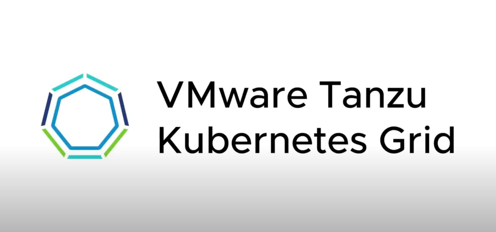
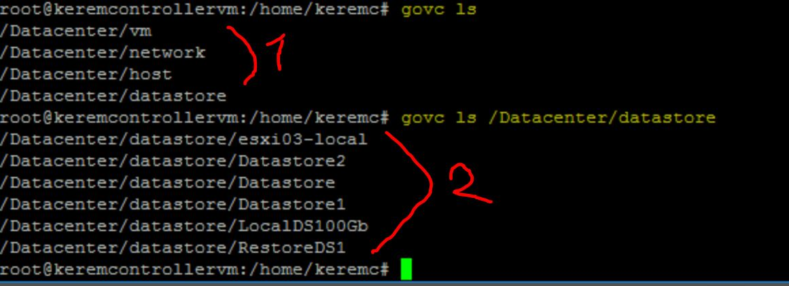
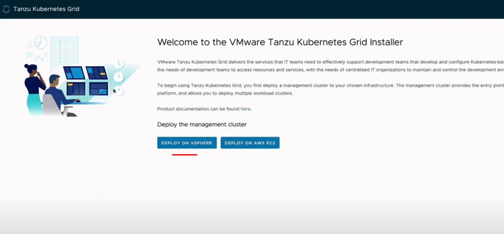
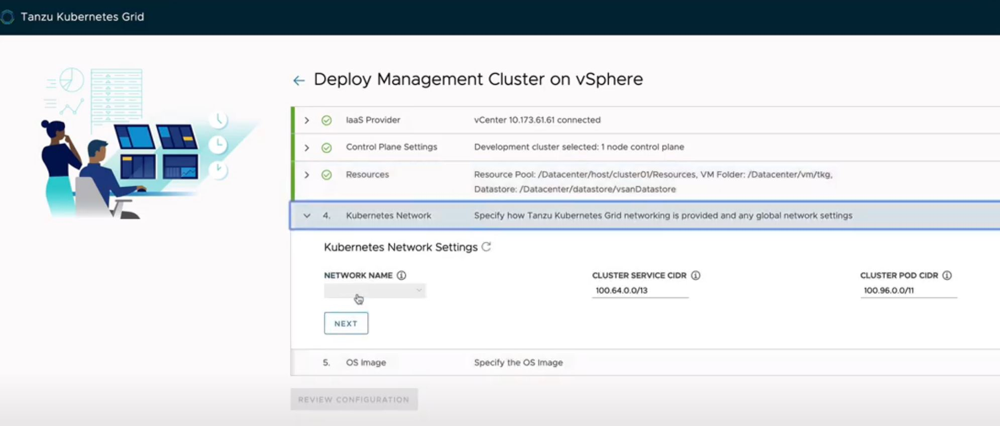

# Quick Deployment VMware Tanzu Kubernetes Grid using Docker Container !
*Written by Kerem ÇELİKER*
- Twitter: **`@CloudRss`**
- Linkedin: **`linkedin.com/in/keremceliker`**
- Blog: **`www.keremceliker.com`**

The vSphere 7 with Kubernetes and Tanzu Kubernetes Grid via TKG, which VMware has built into VCF 4.0 (VMware Cloud Foundation), were introduced in mid-April 2020 in accordance with vSphere 6.7, vSphere 7. It provides the Kubernetes environment, which PKS provides at a basic level, to manage the vSphere with Kubernetes very easily centrally from within vCenter. Also VCF 4.0 and vSphere 7 can be built-in vCenter 7 where vSphere with Kubernetes. 

The most important thing is DevOps & DevCloud teams can create their Kubernetes clusters and work on their Kubernetes clusters through the CLI isolated from vCenter with the authority they want to have..

In this article, I will show you how to install "VMware Tanzu Kubernetes Grid (Pivotal) and Integrate into VMware ESXi Infrastructure with Kubernetes.


  
  
  

## Pre-Requisites

1.1) *Introductions:*

- Ubuntu or RedHat Linux Server (I prefer to have it but you can go on Windows10 if you wonder)
- VMware Tanzu "TKG-CLI" will be installed
- Govc CLI needs to be configured it.
- KubeCtl always have to be installed.
- Docker Container version 18.09 must be installed in your Linux or Windows build
	*As part of the TKG Cli deployment, it creates a OnPrem Kubernetes Cluster on the VMware Guest and uses it to attach the boot-strap to the target Tanzu Kubernete Grid.
- VMware vSphere ESXi 6.7
- Python3 Tool
- Putty
- PuttyGen


1.2) *Links for Pre-Requisites:*

  -	Install latest version of  [Tanzu Kubernetes Grid CLI Tool and OVA Files](https://my.vmware.com/group/vmware/info/slug/infrastructure_operations_management/vmware_tanzu_kubernetes_grid/1_x)
  -	Install latest version of [VMware vSphere ESXi 7](https://www.vmware.com/go/download-vsphere)
  -	Install latest version of  [Docker CE](https://docs.docker.com/install/linux/docker-ce/)
  - Install latest version of [Govc Tool for VMware Tasks](https://github.com/vmware/govmomi/releases)
  - Install latest version of Kubernetes [KubeCtl - Kubernetes CLI](https://kubernetes.io/docs/tasks/tools/install-kubectl/)


## Instructions on VMware Tanzu Kubernetes Grid using Kubernetes & Pivotal Concepts

1- *The following needs to be Have and Downloaded:*
```
Photon v3 Kubernetes v1.17.3 OVA File for Linux
**********
Photon v3 Capv Haproxy v0.6.3 OVA File for Linux
```

  
  
  

2- *Install Govc for Linux :*
```
wget https://github.com/vmware/govmomi/releases/download/v0.22.1/vc_linux_amd64.gz
root@keremcontrollervm:/home/keremc# gzip -d govc_linux_amd64.gz
root@keremcontrollervm:/home/keremc# chmod +x govc_linux_amd64
root@keremcontrollervm:/home/keremc# mv govc_linux_amd64 /usr/local/bin/govc

 
```

  

3- *Install Tanzu TKG Tool for Linux :*
```
wget https://github.com/vmware/govmomi/releases/download/tkg-linux-amd64-v1.0.0_vmware.1.gz

**Follow the above same-steps as Govc
```

4- Create Docker Container on Your Linux VM for the Tanzu TKG installation on the vCenter vSphere for Boot-Strap Process;
```
$ sudo apt-get update
$ sudo apt-get install docker-ce docker-ce-cli containerd.io
$ apt-cache madison docker-ce
$ sudo apt-get install docker-ce=<VERSION_STRING> docker-ce-cli=<VERSION_STRING> containerd.io (Choose 5.18 or 5.19, It's up to you)
$ sudo docker run hello-world (for Verify to correctly running Docker Contaianer Services)
```
```
root@keremcontrollervm:/home/keremc# sudo apt-get install docker-ce=5:18.09.9~3-0~ubuntu-bionic dockerd.io
Reading package lists... Done
Building dependency tree
Reading state information... Done
containerd.io is already the newest version (1.2.13-1).
The following packages will be DOWNGRADED:
  docker-ce docker-ce-cli
0 upgraded, 0 newly installed, 2 downgraded, 0 to remove and 244 not upgraded.
Need to get 34.7 MB of archives.
After this operation, 122 MB disk space will be freed.
Do you want to continue? [Y/n] Y
Get:1 https://download.docker.com/linux/ubuntu bionic/stable amd64 docker-ce-cli amd64 5:18.09.9~3-0~u
Get:2 https://download.docker.com/linux/ubuntu bionic/stable amd64 docker-ce amd64 5:18.09.9~3-0~ubunt
Fetched 34.7 MB in 5s (7,603 kB/s)
dpkg: warning: downgrading docker-ce-cli from 5:19.03.8~3-0~ubuntu-bionic to 5:18.09.9~3-0~ubuntu-bion
(Reading database ... 66851 files and directories currently installed.)
Preparing to unpack .../docker-ce-cli_5%3a18.09.9~3-0~ubuntu-bionic_amd64.deb ...
Unpacking docker-ce-cli (5:18.09.9~3-0~ubuntu-bionic) over (5:19.03.8~3-0~ubuntu-bionic) ...
dpkg: warning: downgrading docker-ce from 5:19.03.8~3-0~ubuntu-bionic to 5:18.09.9~3-0~ubuntu-bionic
Preparing to unpack .../docker-ce_5%3a18.09.9~3-0~ubuntu-bionic_amd64.deb ...
Unpacking docker-ce (5:18.09.9~3-0~ubuntu-bionic) over (5:19.03.8~3-0~ubuntu-bionic) ...
Processing triggers for ureadahead (0.100.0-20) ...
Processing triggers for systemd (237-3ubuntu10) ...
Processing triggers for man-db (2.8.3-2) ...
Setting up docker-ce-cli (5:18.09.9~3-0~ubuntu-bionic) ...
Setting up docker-ce (5:18.09.9~3-0~ubuntu-bionic) ...
update-alternatives: using /usr/bin/dockerd-ce to provide /usr/bin/dockerd (dockerd) in auto mode
```

```
root@keremcontrollervm:/home/keremc# sudo docker run hello-world
Unable to find image 'hello-world:latest' locally
latest: Pulling from library/hello-world
0e03bdcc26d7: Pull complete
Digest: sha256:8e3114318a995a1ee497790535e7b88365222a21771ae7e53687ad76563e8e76
Status: Downloaded newer image for hello-world:latest

Hello from Docker!!!!

This message shows that your installation appears to be working correctly !!
```


5- *Create a Blank-Text with *.json script file :*
```
root@keremcontrollervm:/home/keremc# cat keremvc.gov
export GOVC_URL=https://192.168.1.3
export GOVC_USERNAME=administrator@vsphere.local
export GOVC_PASSWORD=KeremCeliker2020-!
export GOVC_INSECURE=true
export GOVC_DATASTORE=/Datacenter/datastore/K8sForNAS
export GOVC_RESOURCE_POOL='*/Resources'
export GOVC_DATACENTER=Datacenter
```

6- *Let's make pre-setup to connect to VMware vCenter and create Json script on it:*
```
 govc import.spec photon-3-v1.17.3_vmware.2.ova | jq '.Name="photon-3-v1.17.3_vmware.2"' | jq '.Name="photo0].Network="VM-Network"' > photon-3-v1.17.3_vmware.1.json
```


7- Import the Photon OVA file to vCenter by JSON script;
```
govc import.ova -options=photon-3-v1.17.3_vmware.1.json photon-3-v1.17.3_vmware.2.ova
```

8- Must be also complete on Proxy OVA File with the same-step;


Don't forget do tag follows below as OVA template with GOVC CLI
```
govc vm.markastemplate photon-3-v1.17.3
govc vm.markastemplate photon-3-capv-haproxy-v0.6.3
```

9- Extract Tanzu TKG CLI file move to under path /usr/loca/bin/ 
```
mv tkg-linux-amd64-v1.0.0_vmware.1 /usr/local/bin/tkg
```

10- Use SSH connection with the following tunneling by Putty to start a Tanzu Kubernetes GUI for Browser
```
tkg init --ui
```

11- And now You are ready to Install VMware Tanzu Kubernetes Grid Page from Chrome/FireFox
```
http://127.0.0.1/#/ui
```


  


12- Go with Step by Step Deploy Management Cluster on vSphere  ;

  


- Set your IaaS Provider Informations as SSH Key,Username-Password.

- Select and Input your Control-Plane, Instance Type as Development or Prod, MGMT Cluster Name and Load-Balancer API Server
   
   *Just skip Production Section for now :-) Ha-Proxy OVA template that will do as the load balancer for management plane on Kubernetes.
   
     
	

- Consider your VM-Resources Pool as Pool-Name with Path and Folder/DataStore

- Make sure Kubernetes run in the correct Network VXLAN and Adapter as Pod/Worker Nodes

  
  

- Choose your specify the OS Template or ISO (You can quick-skip it this step with Next)

13- Please Review your all Tanzu & Kubernetes Configurations and Deploy & Enjoy ! :)


14- Let's Show and Check Tanzu Kubernetes Cluster in VMware vSphere
```
tkg get management-cluster
kubectl get nodes
```

- If you have no any Tanzu Kubernetes Cluster as Worker Machine after step 12, just follow the command below for Troubleshoot;
```
tkg create cluster MyFirstTanzuCluster --plan=DevOps --worker-machine-count=4
```
  
15-As Straight-Forward we will create a cool small Hello-World page on the VMware Tanzu K8s Grid for Test.
```
tkg create cluster Hello-Tanzu-From-Kerem --plan prod --kubernetes-version v1.18.3_vmware.2 --controlplane-machine-count 1 --worker-machine-count 1
```

- Let's take a short-look what's going on Kubernetes Cluster Inside.
```
kubectl get nodes && kubectl config get-contexts
tkg get cluster
```

```
NAME                                                STATUS    ROLES    AGE     VERSION
Hello-Tanzu-From-Kerem   					         Ready    master   18h   v1.18+vmware.1
Hello-Tanzu-From-Kerem-md-0-87y3t6p011-u2gbz         Ready    <none>   18h   v1.18+vmware.1
Hello-Tanzu-From-Kerem-md-0-87y3t6p011-hka5o   		 Ready    <none>   18h   v1.18+vmware.1
Hello-Tanzu-From-Kerem-md-0-87y3t6p011-km7rx   		 Ready    <none>   18h   v1.18+vmware.1
```

  